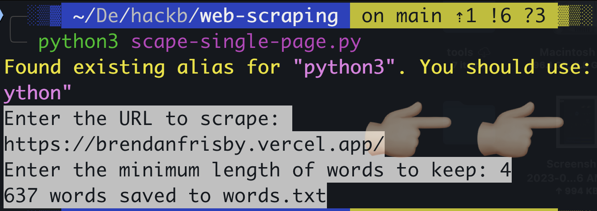
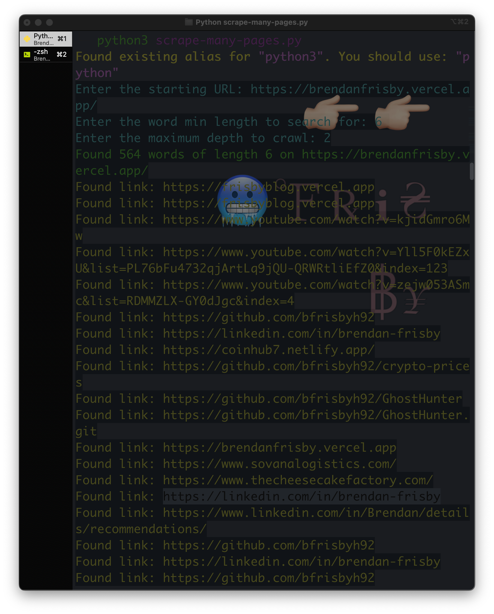
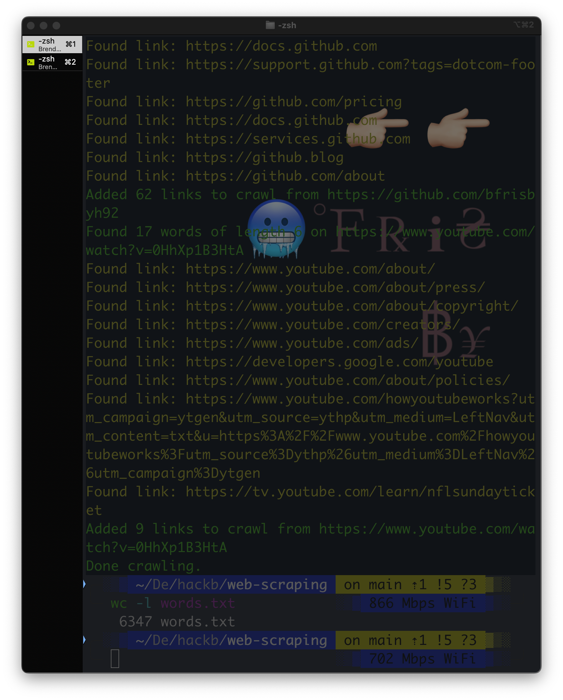

<h1 align='center'>Python Web Scraper</h1>

<h2 align='center'><a href="https://github.com/bfrisbyh92/Python-Wordlist-Webscraper" target="_blank">Github.com/bfrisbyh92/Python-Wordlist-WebScraper</a></h2>

-------------------------------

<h3 align='center'>**A Python web scraper for creating wordlists similiar to tools like Cewl**</h3>

----------

### ***1) A simple script to crawl one web page for all the words over a specific length***

##### Single Scrape Image Below

----------

### ***2) A more advanced way to gather words. It collects the words on the original page, as well as the links. It adds those links to a list, and crawls them as well. The user sets depth level at start of the script. Be careful going over 3-4. This will take a long time to run, and if you crawl a blog or the like relative to your target you can easily grab 100k good words in one hour.*** 

------------
***Scraped with depth set as 2 with my own website as target***

------------------
***Same session as above, just the end portion with a word count on text file.
6,347 words collected***

<h1 align='center'>Installation</h1>
<ul>
<li>
   (1) - git clone https://github.com/bfrisbyh92/Python-Wordlist-Webscraper.git
</li>
<li>
   (2) - pip install -r requirements.txt
</li>
<li>
   (3) - python3 scrape-many-pages.py OR python3 scape-single-page.py
</li>
<li>
   (4) - Enter required inputs when application asks
</li>
<li>
   (5) - Further process the wordlists, removing duplicates and unwanted words. You can use a tool like Crunch(On Kali Linux) but it is much more valuable for you to write a script like this to handle tasks. I can use Cewl for scraping web pages, but whenever I add more than 2-3 options, Cewl breaks entirely. Hence why I made 
</li>
</ul>